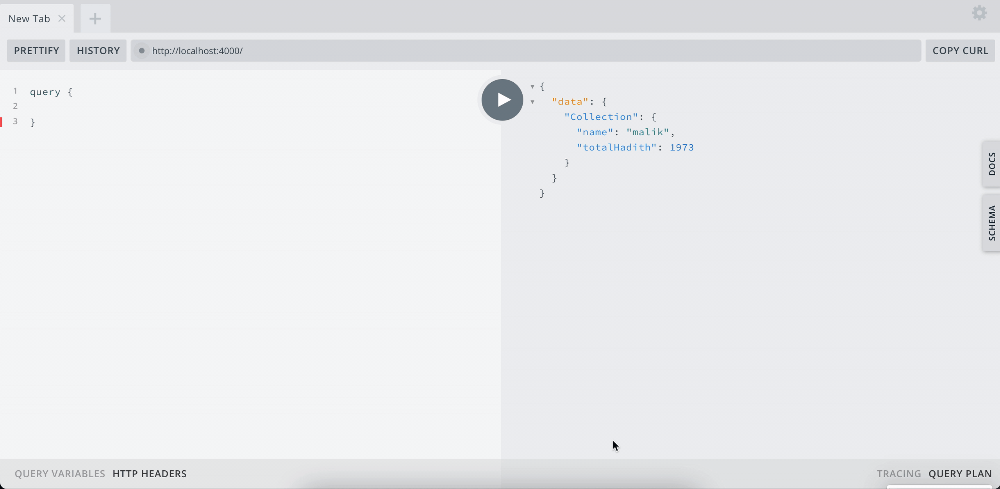

# GraphQL-API-Sunnah.com

Simple GraphQL layer on top of [Sunnah.com's REST API](https://sunnah.api-docs.io/1.0/getting-started)



# Getting Started

Create a `.env` file based off of `.env.sample`. You can get a demo x-api-key from the [API docs](https://sunnah.api-docs.io/1.0/getting-started) under some of the listed endpoints.

You can also use the real api key if you have it.

To install dependencies run

```
npm install
```

To run the app

```
npm start
```

# Disclaimer

I am not affiliated with Sunnah.com. This was just something I created over a weekend and thought would be beneficial to app developers by giving them a more declarative way of asking for the data they need.
